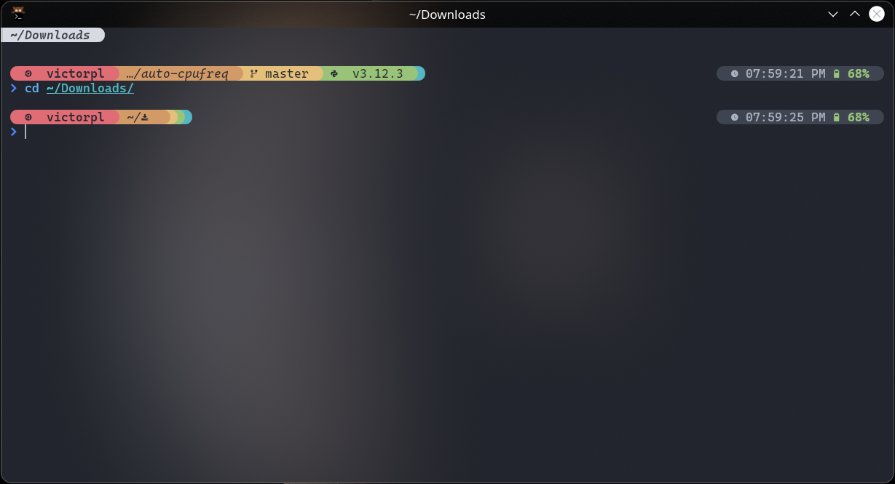
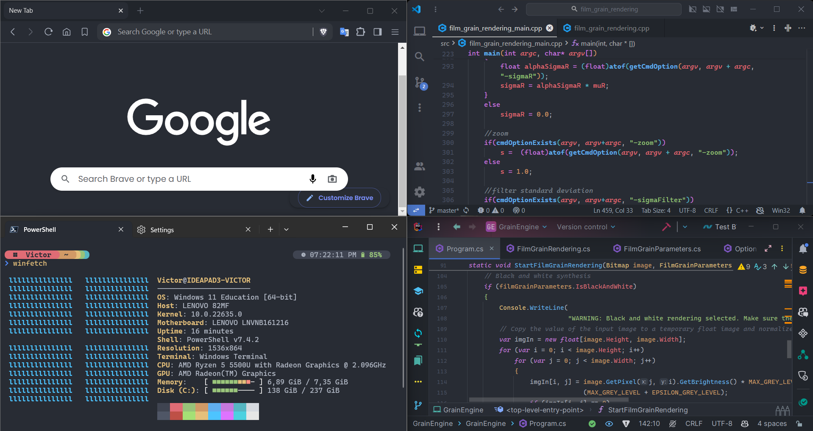
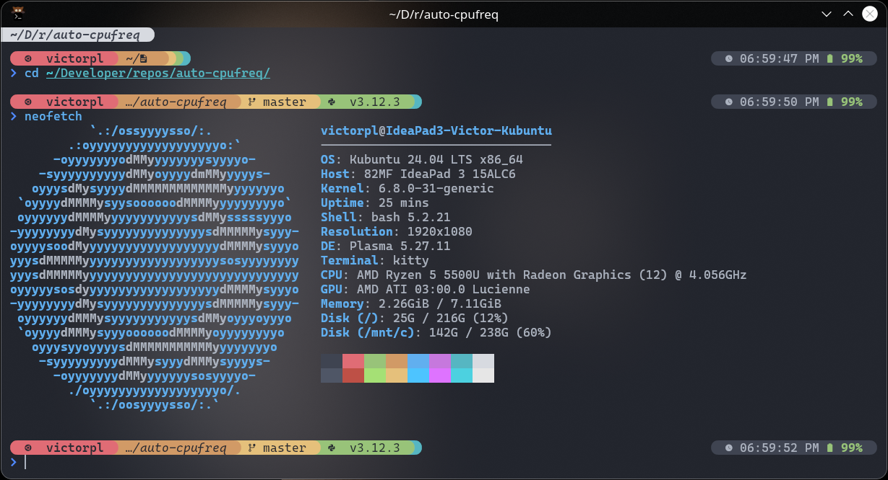

# One Dark Pro Theme for Kitty

## [GitHub Repo](https://github.com/VictorPLopes/OneDark-Pro-Kitty-Terminal)

I like to keep my software consistent and uniform, which is why I try to use the same theme on most of my apps. This is why I made a Windows Terminal theme inspired by my favorite theme, [Binaryify's One Dark Pro theme for Visual Studio Code](https://github.com/Binaryify/OneDark-Pro). There is already a One Dark implementation bundled with Windows Terminal, "One Half Dark", but it's not exactly the same as Binaryify's.



## VictorPL's One Dark Collection

- [One Dark Pro for Visual Studio Code (by Binaryify)](https://github.com/Binaryify/OneDark-Pro)
- [One Dark Pro for Visual Studio (by Binaryify)](https://marketplace.visualstudio.com/items?itemName=zhuangtongfa.onedarkpro)
- [One Dark Pro for Windows Terminal](https://github.com/VictorPLopes/OneDark-Pro-Windows-Terminal)
- [One Dark Pro for Kitty Terminal](https://github.com/VictorPLopes/OneDark-Pro-Kitty-Terminal)
- [One Dark Pro for Chromium Browsers](https://github.com/VictorPLopes/OneDark-Pro-Chromium)
- [One Dark Pro for Starship Prompt](https://github.com/VictorPLopes/OneDark-Pro-Starship)
- [One Dark Pro for Neovim (by olimorris)](https://github.com/olimorris/onedarkpro.nvim)
- [One Dark Pro for iTerm (by chinhsuanwu)](https://github.com/chinhsuanwu/one-dark-pro-iterm)
- [One Dark for JetBrains IDEs (by Mark Skelton)](https://plugins.jetbrains.com/plugin/11938-one-dark-theme)



## Screenshots

### Fish, Kitty Terminal, Kubuntu 24



## Pre-requisites

- If you are using the Starship Prompt, [my One Dark Pro preset for Starship](https://github.com/VictorPLopes/OneDark-Pro-Starship) is highly recommended. If you aren't, you can still use the theme, but it won't be as consistent and I highly recommend you give Starship a try.

## How to install

The installation process is simple, just follow the steps below:

- Download the latest version of the theme to your `kitty-themes` folder with the following command:

```bash
wget "https://raw.githubusercontent.com/VictorPLopes/OneDark-Pro-Kitty-Terminal/main/themes/OneDark-Pro.conf" -P ~/.config/kitty/themes
```

- Create a symlink:

```bash
ln -s ~/.config/kitty/themes/OneDark-Pro.conf ~/.config/kitty/current-theme.conf
```

- Apply the theme to Kitty:

```bash
printf '\ninclude ./current-theme.conf' >> ~/.config/kitty/kitty.conf
```

## Add tabs, transparency and other QoL changes (like in the screenshots)

To add tabs to Kitty, simply add the following text to your kitty.conf file:

```conf
# Set up the tab bar
tab_bar_min_tabs            1
tab_bar_edge                top
tab_bar_style               powerline
tab_powerline_style         round
tab_title_template          {title}{' :{}:'.format(num_windows) if num_windows > 1 else ''}
```

For transparency and blur, you can copy the following code. As far as I know, only KDE Plasma supports blur:

```conf
# Set up the background
background_opacity 0.75
background_blur 16
```

You can also add a nice margin to the terminal by adding the following text to the file:

```conf
# Set up the window margin
window_margin_width 8
```

Alternatively, you can copy [my kitty.conf file](./kitty.conf) to `~/.config/kitty`, which already has everything mentioned above (and the theme enabled):

```bash
wget "https://raw.githubusercontent.com/VictorPLopes/OneDark-Pro-Kitty-Terminal/main/kitty.conf" -P ~/.config/kitty
```

## Support me

If you like this theme, and my work, you can always support me via **[Ko-fi](https://ko-fi.com/victorplopes)**. If I get enough support, I will pay the developer registration fee and publish my port of the One Dark Pro theme for Chromium Browsers on the Chrome Web Store.
</br>
<a href='https://ko-fi.com/S6S7DTZCA' target='_blank'></a>

## [CHANGELOG](./CHANGELOG.md)
